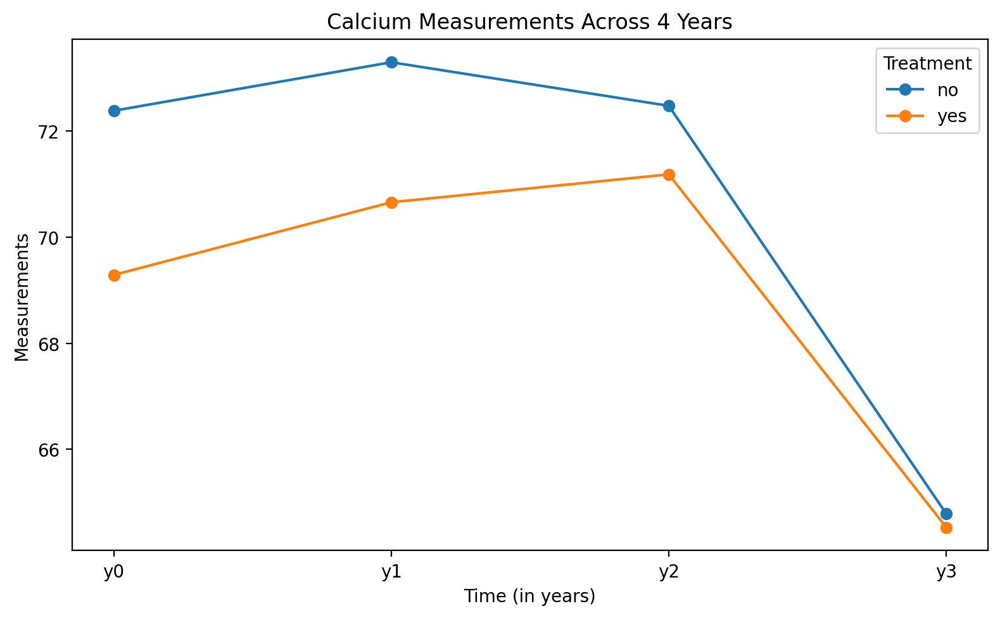

```{r}
#|include: false
library(tidyverse)
library(rvest)
library(ggplot2)
library(kableExtra)
library(patchwork)

```

# I. Busiest Airport Analysis

```{r}
#|label: readInATLdata
#|include: false

# split up URL to fit on page

baseURL <- "https://en.wikipedia.org/wiki/"
specificURL <- "Hartsfield%E2%80%93Jackson_Atlanta_International_Airport"

ATLdata <- read_html(
  x = paste0(baseURL, specificURL)
) |>
  html_elements(css = "table") |> # format as table
  html_table()

```

```{r}

ATLairlines <- ATLdata[[5]][1] |> mutate(
  airport = "ATL", # create a column with each entry as ATL
  .after = "Airlines"
)

```

```{r}
FRAdata <- read_html(
  x = "https://en.wikipedia.org/wiki/Frankfurt_Airport"
) |>
  html_elements(css = "table") |>
  html_table()

```

```{r}
FRAairlines <- FRAdata[[9]][1] |> mutate(
  airport = "FRA",
  .after = "Airlines"
)

```

```{r}
PKXdata <- read_html(
  x = "https://en.wikipedia.org/wiki/Beijing_Daxing_International_Airport"
) |>
  html_elements(css = "table") |>
  html_table()

```

```{r}
# get data from airline lists
PKXLocations <- PKXdata[[6]]
PKXLocations2 <- PKXdata[[7]]

# create airline dataframe
PKXairlines <- bind_rows(PKXLocations, PKXLocations2) |> mutate(
  airport = "PKX",
  .after = "Airlines"
)

# remove the unnecessary dataframes
rm(PKXLocations)
rm(PKXLocations2)

```

```{r}
# read in DFW data from wikipedia
DFWdata <- read_html(
  x = "https://en.wikipedia.org/wiki/Dallas_Fort_Worth_International_Airport"
) |>
  html_elements(css = "table") |>
  html_table()

```

```{r}
# create DFW airlines dataframe
DFWairlines <- DFWdata[[5]][1] |> mutate(
  airport = "DFW",
  .after = "Airlines"
)

```

```{r}
# read in Heathrow data from wikipedia
Heathrowdata <- read_html(
  x = "https://en.wikipedia.org/wiki/Heathrow_Airport"
) |>
  html_elements(css = "table") |>
  html_table()

```

```{r}
# get data from airlines lists
HeathLocations <- Heathrowdata[[5]][1]
HeathLocation2 <- Heathrowdata[[6]][1]

# create airline dataframe
HeathrowAirlines <- bind_rows(HeathLocations, HeathLocation2) |> mutate(
  airport = "LHR",
  .after = "Airlines"
)

```

```{r}
# read in data from wikipedia
ISTdata <- read_html(
  x = "https://en.wikipedia.org/wiki/Istanbul_Airport"
) |>
  html_elements(css = "table") |>
  html_table()

```

```{r}
# create airlines dataframe
ISTairlines <- ISTdata[[4]][1] |> mutate(
  airport = "IST",
  .after = "Airlines"
)

```

```{r}
# Create combined dataframe of airlines data ----
# split up so lines aren't long
airlines1 <- bind_rows(DFWairlines, HeathrowAirlines, FRAairlines)
airlines2 <- bind_rows(ISTairlines, ATLairlines, PKXairlines)
combinedAirlines <- bind_rows(airlines1, airlines2)

```

```{r}
airlineAirportComparison <- combinedAirlines |>
  select(Airlines, airport) |> # select needed columns
  mutate( # create a repeat column of airport
    airport_2 = airport,
    .after = airport
  ) |>
  pivot_wider( # pivot wider
    id_cols = Airlines,
    names_from = airport,
    values_from = airport_2
  )

```

```{r}
airlineCounts  <- combinedAirlines |>
  count(Airlines) # count each airline

```

```{r}
airlineInformation <- left_join( # join the dataframes together
  x = airlineAirportComparison,
  y = airlineCounts,
  by = join_by(Airlines == Airlines)
) |>
  filter(n > 3) |>
  arrange(desc(n)) |>
  # remove all of the NA values so the table looks cleaner
  mutate(
    DFW = recode_values(
      x = DFW,
      NA ~ " ",
      default = DFW
    )
  ) |>
  mutate(
    LHR = recode_values(
      x = LHR,
      NA ~ " ",
      default = LHR
    )
  ) |>
  mutate(
    FRA = recode_values(
      x = FRA,
      NA ~ " ",
      default = FRA
    )
  ) |>
  mutate(
  IST = recode_values(
    x = IST,
    NA ~ " ",
    default = IST
  )) |>
  mutate(
    ATL = recode_values(
      x = ATL,
      NA ~ " ",
      default = ATL
    )
  ) |>
  mutate(
    PKX = recode_values(
      x = PKX,
      NA ~ " ",
      default = PKX
    )
  ) |> select(Airlines, DFW, LHR, FRA, IST, ATL, PKX)

```

```{r}
#| label: tbl-airlineFrequency
#| tbl-cap: "Frequency of Airlines at Major Airports"
#| tbl-pos: H
#| include: true

airlineInformation |>
  kable(
    #caption = "Frequency of Airlines at Major Airports", # title
    align = "cc", 
    row.names = TRUE # this gives numbered row names
  ) |>
  kable_classic(
    lightable_options = "striped" # improves table readability
  )
```

```{r}
# read in passenger data table
ATLpassengers <- ATLdata[[11]]

# add a column name to the dates column
names(ATLpassengers)[1] <- "Year"

```

```{r}
# wrangle data
ATLpassengers <- ATLpassengers|>
  # removes the last row of the dataframe with source information
  slice_head(n=26) |>
  # makes the column numeric so i can use filter with numerical values
  mutate(
    Year = as.numeric(Year)
  ) |>
  # filters where dates are past 2019
  filter(Year > 2019) |>
  # adds a column so each entry has information of which airport it is from:
  # useful for when I bind the rows together from different airports
  mutate(
    airport = "ATL",
    .after = Passengers
  ) |> # select only the columns year, airport, and Passengers 
       # so i can bind with other dataframes
  select(Year, Passengers, airport) |>
  mutate(
    Passengers = readr::parse_number(Passengers, na = c("--","","NA"))
  )

```

```{r}
# Frankfurt Wrangling (FRA) 

FRApassengers <- FRAdata[[14]] |>
  # filter where
  filter(Year > 2019) |>
  # add marker column to help keep track of which airport this data is from
  mutate(
    airport = "FRA",
    .after = Passengers
  ) |> # select only the columns dates, airport, and Passengers 
       #so i can bind with other dataframes
  select(Year, Passengers, airport) |>
  # make sure Passenger column is only numbers
  mutate(
    Passengers = readr::parse_number(Passengers, na = c("--","","NA"))
  )

```

```{r}
# Beijing Wrangling (PKX) ----

PKXpassengers <- PKXdata[[9]]

names(PKXpassengers)[2] <- "Passengers"

```

```{r}
PKXpassengers <- PKXpassengers |>
  # Change Year and Total passenger to have only numbers
  mutate(
    Year = readr::parse_number(Year, na = c("--","","NA"))
  ) |> # make the passengers column only have numeric entries
  mutate(
    Passengers = readr::parse_number(Passengers, na = c("--","","NA"))
  ) |> select(Year, Passengers) |> # select columns
  mutate( # add an airport column
    airport = "PKX",
    .after = "Passengers"
  ) |> filter(Year < 2026) # filter where the year is less than 2026

```

```{r}
# get correct data columns from DFW data
DFWpassengers1 <- DFWdata[[11]][5:6]
DFWpassengers2 <- DFWdata[[11]][7:8]

```

```{r}
DFWpassengers <- bind_rows(DFWpassengers1,DFWpassengers2) |> # combine rows
  filter(Year > 2019 & Year < 2026) |> # filter years between 2020 and 2025
  mutate( # create an airport column
    airport = "DFW",
    .after = "Passengers"
  ) |>
  mutate( # make the passenger column numeric
    Passengers = readr::parse_number(Passengers, na = c("--","","NA"))
  )

```

```{r}
# remove unnecessary dataframes
rm(DFWpassengers1)
rm(DFWpassengers2)

```

```{r}
# Heathrow Airport (LHR) ----
# retrieve data from LHR data about passengers
LHRpassengers <- Heathrowdata[[7]][1:2] |> 
  rename( # rename column to Passengers so I can bind rows
    Passengers = "Passengers handled[a]"
  ) |> slice_tail(n = 5) |>  # get the correct dates
  mutate( # create an airport column
    airport = "LHR",
    .after = "Passengers"
  ) |>
mutate( # change the passengers column to be numeric and only a number
    Passengers = readr::parse_number(Passengers, na = c("--","","NA"))
  ) |>
  mutate( # make the year column numeric
    Year = as.numeric(Year)
  )

```

```{r}
# Istanbul Airport Wrangling ----
ISTpassengers <- ISTdata[[5]] |> # get correct data from IST dataframe
  select(Year, "Total passengers") |> # select necessary columns
  mutate( # make the year column only numbers
    Year = readr::parse_number(Year, na = c("--","","NA"))
  ) |>
  rename( # rename to passengers column to bind rows
    Passengers = "Total passengers"
  ) |>
  mutate( # change passenger column data to be numeric
    Passengers = readr::parse_number(Passengers, na = c("--","","NA"))
  ) |>
  filter(Year > 2019 & Year < 2026) |> # filter years from 2020 to 2025
  mutate( # create airport column
    airport = "IST",
    .after = "Passengers"
  )

```

```{r}
# Combine dataframes for passengers ----
# split so the line is shorter
passengers1 <- bind_rows(ATLpassengers, DFWpassengers, ISTpassengers)
passengers2 <- bind_rows(LHRpassengers, FRApassengers, PKXpassengers)
CombinedPassengers <- bind_rows(passengers1, passengers2)

```

```{r}
#| label: fig-passengerData
#| fig-cap: "Major Airport Passenger Totals by Year"
#| fig-pos: H
#| fig-alt: "Line graph showing airport passenger totals by year from 2020 to 2025 for A T L, D F W, F R A, I S T, L H R, and P K X."
#| include: true
#| 
# plot passenger data ----
ggplot(
  data = CombinedPassengers, # dataframe
  mapping = aes(x = Year, # x-axis
                y = Passengers, # y-axis
                shape = airport, # differentiate by shape
                color = airport) # differentiate by color
) + geom_point(size = 2) + # use shapes as points with size 2
  geom_line() + # connect points by lines
 theme_minimal() + # theme of plot
scale_y_continuous(
  breaks = seq(0, 120000000, by = 20000000), # format y-axis
  labels = scales::label_comma()
) +
  labs(
    #title = "Major Airport Passenger Totals by Year", #title
    caption = "Source: Wikipedia"
  )

```

This data was retrieved from Wikipedia pages for each of the airports.
As seen from @fig-passengerData, each airport is a different color and
has different shaped points for those who are color blind. According to
the graph, there is a general upward trend from 2020 of the total number
of passengers at each airport each year. Due to the travel restrictions
in 2020 and years after, the total number of passengers was less in
2020, so it makes sense that they are moving upward overtime. Beijing
International Airport (PKX) had a low around 2022 due to having even
stricter travel restrictions because it is in China.
@tbl-airlineFrequency shows the frequency of airlines at the top
airports. Qatar Airways flies at each airport, Air France flies at every
airport except PKX, etc. Combining the observations from both tables, it
is interesting to note that ATL overall the most passengers, but did not
have all of the top 22 airlines. In comparison, Heathrow (LHR) and
Frankfurt (FRA) have all of the top 22 airlines however they do not have
the most total passengers. This could be an interesting area to further
research.

# II. Monte Carlo

```{r}
generatePoints <- function(x_upper, x_lower, y_upper, y_lower, size){
  #Use runif, it generates a given amount of points within the bounds 
  # for both x and y and adds it to a table.
  x <- runif(size, min = x_lower, max = x_upper)
  y <- runif(size, min = y_lower, max = y_upper)

  #these dataframe columns are combined to generate a single df of coordinates
  points <- bind_cols(x,y)

  # return dataframe
  return(points)}

```

```{r}
# use generatePoints
coordinates <- generatePoints(1, 0, 1.5, 0, 10000)

# change column names
names(coordinates)[1] <- "x"
names(coordinates)[2] <- "y"

```

```{r}
# create a flag column using the dbeta function
coordinates <- coordinates |>
  mutate(
    flag = if_else(y <= dbeta(x,2,2), "on/below","above",missing="missing")
  )

```

```{r}
flag_count <- coordinates |> select(flag) |>
  count(flag) |> mutate(
    proportion = n / sum(n),
    .after = n
  ) |> slice_tail(n = 1) |>
  mutate(
    proportion = as.numeric(proportion)
  )
p <- flag_count[1,3]
proportion <- (1-0) * (1.5 - 0) * p

```

```{r}
# plot10 ----
plot10 <- generatePoints(1, 0, 1.5, 0, 10)

# change column names
names(plot10)[1] <- "x"
names(plot10)[2] <- "y"

```

```{r}
# create a flag column using the dbeta function
plot10 <- plot10|>
  mutate(
    flag = if_else(y <= dbeta(x,2,2), "on/below","above",missing="missing")
  )

flag_count <- plot10 |> select(flag) |>
  count(flag) |> mutate(
    proportion = n / sum(n),
    .after = n
  ) |> slice_tail(n = 1) |>
  mutate(
    proportion = as.numeric(proportion)
  )
p <- flag_count[1,3]
proportion <- (1-0) * (1.5 - 0) * p

```

```{r}

plot10 <- ggplot(
  data = plot10, # dataframe
  mapping = aes(x = x, y = y, colour = flag # use flag as color differentiator
  )
) +
  geom_point() + # type of geometry
  scale_color_hue(direction = 1) +
  labs( # labels for title and caption
    #title = "Monte Carlo Simulation for the Beta Distribution",
    caption = proportion
  ) +
  theme_minimal() + #theme
  stat_function(
    fun = dbeta, # beta distribution function
    args = list(shape1 = 2, shape2 = 2),
    xlim = c(0, 1)
  )

```

```{r}
# plot100 ----
plot100 <- generatePoints(1, 0, 1.5, 0, 100)

# change column names
names(plot100)[1] <- "x"
names(plot100)[2] <- "y"

```

```{r}
# create a flag column using the dbeta function
plot100 <- plot100|>
  mutate(
    flag = if_else(y <= dbeta(x,2,2), "on/below","above",missing="missing")
  )

flag_count <- plot100 |> select(flag) |>
  count(flag) |> mutate(
    proportion = n / sum(n),
    .after = n
  ) |> slice_tail(n = 1) |>
  mutate(
    proportion = as.numeric(proportion)
  )
p <- flag_count[1,3]

proportion <- (1-0) * (1.5 - 0) * p

```

```{r}
plot100 <- ggplot(
  data = plot100, # dataframe
  mapping = aes(x = x, y = y, colour = flag # use flag as color differentiator
  )
) +
  geom_point() + # type of geometry
  scale_color_hue(direction = 1) +
  labs( # labels for title and caption
    #title = "Monte Carlo Simulation for the Beta Distribution",
    caption = proportion
  ) +
  theme_minimal() + #theme
  stat_function(
    fun = dbeta, # beta distribution function
    args = list(shape1 = 2, shape2 = 2),
    xlim = c(0, 1)
  )

```

```{r}
# plot1000 ----

plot1000 <- generatePoints(1, 0, 1.5, 0, 1000)

# change column names
names(plot1000)[1] <- "x"
names(plot1000)[2] <- "y"

```

```{r}
# create a flag column using the dbeta function
plot1000 <- plot1000|>
  mutate(
    flag = if_else(y <= dbeta(x,2,2), "on/below","above",missing="missing")
  )

```

```{r}
flag_count <- plot1000 |> select(flag) |>
  count(flag) |> mutate(
    proportion = n / sum(n),
    .after = n
  ) |> slice_tail(n = 1) |>
  mutate(
    proportion = as.numeric(proportion)
  )
p <- flag_count[1,3]
proportion <- (1-0) * (1.5 - 0) * p

```

```{r}
plot1000 <- ggplot(
  data = plot1000, # dataframe
  mapping = aes(x = x, y = y, colour = flag # use flag as color differentiator
  )
) +
  geom_point() + # type of geometry
  scale_color_hue(direction = 1) +
  labs( # labels for title and caption
    #title = "Monte Carlo Simulation for the Beta Distribution",
    caption = proportion
  ) +
  theme_minimal() + #theme
  stat_function(
    fun = dbeta, # beta distribution function
    args = list(shape1 = 2, shape2 = 2),
    xlim = c(0, 1)
  )

```

```{r}
# plot10000 ----

plot10000 <- generatePoints(1, 0, 1.5, 0, 10000)

# change column names
names(plot10000)[1] <- "x"
names(plot10000)[2] <- "y"

```

```{r}
# create a flag column using the dbeta function
plot10000 <- plot10000|>
  mutate(
    flag = if_else(y <= dbeta(x,2,2), "on/below","above",missing="missing")
  )

```

```{r}
flag_count <- plot10000 |> select(flag) |>
  count(flag) |> mutate(
    proportion = n / sum(n),
    .after = n
  ) |> slice_tail(n = 1) |>
  mutate(
    proportion = as.numeric(proportion)
  )
p <- flag_count[1,3]
proportion <- (1-0) * (1.5 - 0) * p

```

```{r}

plot10000 <- ggplot(
  data = plot10000, # dataframe
  mapping = aes(x = x, y = y, colour = flag # use flag as color differentiator
  )
) +
  geom_point() + # type of geometry
  scale_color_hue(direction = 1) +
  labs( # labels for title and caption
    #title = "Monte Carlo Simulation for the Beta Distribution",
    caption = proportion
  ) +
  theme_minimal() + #theme
  stat_function(
    fun = dbeta, # beta distribution function
    args = list(shape1 = 2, shape2 = 2),
    xlim = c(0, 1)
  )

```

```{r}
#| label: fig-MonteCarlo
#| fig-cap: "Monte Carlo Integration for the Beta Distribution"
#| fig-pos: H
#| fig-alt: "Four scatter plots showing Monte Carlo simulations for a Beta Distribution, varying dot densities above and below a curved line in each plot."

plot10 + plot100 + plot1000 + plot10000
```

According to the plots in @fig-MonteCarlo, the estimated numerical
integration ranged from 1.2 to 0.996. It makes the most sense to think
that the plot with the most number of points would have the most
accurate estimated numerical integration. The red dots mean that the
point is above the function line and the blue dots mean that the
coordinates were below or on the function line. I think since the graph
with the most amount of points is the most accurate, so the numerical
integration is around 0.996.

# III. Gen AI Section

## Personal Plan

### Goals

The goal is to tidy the data from the calcium dataset and create a plot
which shows the averages of the results per year for the treatment and
control group.

### Needs

Nouns: calcium dataset, ggplot2, controlGroup, combinedGroup, tidyverse,
treatmentGroup, title, label Verbs: create, slice, add, bind_rows,
average, mutate, geom_line

### Steps

#### Tidy Data

1.  Load in necessary packages into RStudio
2.  Load in the calcium file to RStudio
3.  Create a new dataframe, called controlGroup, for the control group
    of women by slicing the first four columns
4.  Create a new dataframe, called treatmentGroup, for the treatment
    group of women by slicing the second four columns
5.  For each dataframe, add a new column called treatment
6.  For controlGroup, the treatment column entries should be "no"
7.  For the treatmentGroup, the treatment column entries should be "yes"
8.  For each dataframe, manipulate the data to get it into a format of a
    year column, an average column (which will be the average for that
    year), and a treatment column
9.  Bind the rows of controlGroup and treatmentGroup to combinedGroup

#### Graph Data

1.  Use ggplot to format a plot from the dataframe combinedGroup
2.  The x-axis is the year column, y-axis is average column, and color
    is treatment column
3.  Use geom_line to connect the points by lines
4.  Use minimal theme
5.  Label the x-axis Time (in years) and the y-axis "Measurements"
6.  Give the plot a title "Calcium Measurements Across 4 Years"

## AI Section

{#fig-genericPlot fig-align="center" fig-pos=H fig-alt="Line graph showing average values per column with fluctuations across categories y0 to y3.1."}


{#fig-promptedPlot fig-align="center" fig-pos=H fig-alt="Line graph showing calcium measurements over four years with blue and orange lines for untreated and treated groups."}


When comparing [@fig-genericPlot] and [@fig-promptedPlot], it is clear
there are differences between the graphs. The initial difference which
stands out is the x-axis. In @fig-genericPlot, ChatGPT did not have the
context behind the data so it plotted the treatment and control groups
next to each other, as if their time scales were different. This goes to
show the limitations of AI and how its interpretation of data can be
extremely inaccurate. In @fig-promptedPlot, where ChatGPT had a more
developed prompt with a plan to go off of, the figure relays more
accurate information about the data. @fig-genericPlot is misleading as
it seems to display that the average values rise, tank, rise, and tank
again, whereas in reality, this is not the case. Also, the labels on the
figure are not descriptive and do not give the viewer adaquate
information about the data. Again, this shows the vast limitations of AI
and how it is not able to replace humans to understand context behind
data.

# IV. Reflection

Looking back on this semester, I am amazed at everything I have learned
through this course. I remember during the first few assignments being
so confused at the syntax of R, since I had only ever had a python
coding background. Through lots of trial and error, R has become a much
more comfortable language for me to code and work in. One of my favorite
parts of this semester was participating in DataFest. At the beginning
of Datafest, my team and I, all freshmen, were extremely overwhelmed and
unsure if we had the technical skills to do anything with the data.
However, we began with trying to understand more about the data context
to help us brainstorm how to best analyze the data. From there, we took
it one step at a time, asking the questions "what information do I want
to find out?" "how do I get that information?" "which dataset would that
be a part of?". Between hours of wrangling and interpreting data, I felt
a lot more confident with what different functions meant and I had a
better grasp on how data can change forms. Over the course of the
weekend, we deepened our understanding of what it looks like to work
with real-world data in a way which tells a broader story. Coming out of
that weekend, I felt very proud of the fact I could use some of the
skills I had learned in class and apply them to a real-world situation.


\newpage
# V. Appendix

## GenAI Appendix

AI tool / model: GPT -5.4

Date: 4/15/2026

**Prompt 1:**
https://www.dropbox.com/scl/fi/8t7an5pjbjaxzpxzydshh/calcium.csv?rlkey=7u7a2z2xriqfqqzyyylpadjfu&dl=1
Goals: The goal is to tidy the data from the calcium dataset and create
a plot which shows the averages of the results per year for the
treatment and control group.

Needs: Nouns: calcium dataset, ggplot2, controlGroup, combinedGroup,
tidyvest, treatmentGroup, title, label Verbs: create, slice, add,
bind_rows, average, mutate, geom_line

Steps

Tidy Data

1.  Load in necessary packages into RStudio

2.  Load in the calcium file to RStudio

3.  Create a new dataframe, called controlGroup, for the control group
    of women by slicing the first four columns

4.  Create a new dataframe, called treatmentGroup, for the treatment
    group of women by slicing the second four columns

5.  For each dataframe, add a new column called treatment

6.  For controlGroup, the treatment column entries should be "no"

7.  For the treatmentGroup, the treatment column entries should be "yes"

8.  For each dataframe, manipulate the data to get it into a format of a
    year column, an average column (which will be the average for that
    year), and a treatment column

9.  Bind the rows of controlGroup and treatmentGroup to combinedGroup

Graph Data

1.  Use ggplot to format a plot from the dataframe combinedGroup

2.  The x-axis is the year column, y-axis is average column, and color
    is treatment column

3.  Use geom_line to connect the points by lines

4.  Use minimal theme

5.  Label the x-axis Time (in years) and the y-axis "Measurements"

6.  Give the plot a title "Calcium Measurements Across 4 Years"

**Response of AI:**

I’m checking the file layout first so I can give you code that matches
the actual column names and doesn’t force you to guess.

Thought for 24s

Here is a clean way to do it in R using tidyverse:

Load packages library(tidyverse)

Load the calcium file calcium \<- read_csv("calcium.csv")

Control group = first 4 columns controlGroup \<- calcium \|\>
select(1:4) \|\> mutate(treatment = "no") \|\> pivot_longer( cols = 1:4,
names_to = "year", values_to = "measurement" ) \|\> group_by(year,
treatment) \|\> summarize( average = mean(measurement, na.rm = TRUE),
.groups = "drop" )

Treatment group = second 4 columns treatmentGroup \<- calcium \|\>
select(5:8) \|\> mutate(treatment = "yes") \|\> pivot_longer( cols =
1:4, names_to = "year", values_to = "measurement" ) \|\> group_by(year,
treatment) \|\> summarize( average = mean(measurement, na.rm = TRUE),
.groups = "drop" )

Bind both together combinedGroup \<- bind_rows(controlGroup,
treatmentGroup)

Optional: make year order cleaner if needed combinedGroup\$year \<-
factor(combinedGroup year, levels = unique(combinedGroup\$year))

Plot ggplot(combinedGroup, aes(x = year, y = average, color = treatment,
group = treatment)) + geom_line() + geom_point() + theme_minimal() +
labs( title = "Calcium Measurements Across 4 Years", x = "Time (in
years)", y = "Measurements", color = "Treatment" )

One likely issue: your prompt says “tidyvest”, but in R this should
almost certainly be tidyverse.

If your file actually has different column positions for control and
treatment, paste the first few rows and I’ll adjust the code to the
exact layout.

**Prompt 2:**

Can you render the plot using the data from the file?

**AI Response 2:**

I’m pulling the CSV and checking the columns so I can render the actual
plot from your file rather than a guessed structure.

The direct Dropbox link is redirecting in a way the tools here won’t
safely open. I’m trying one more route using the resolved file URL so I
can still render it from the actual CSV.

Thought for 46s

I can render it, but I could not reliably fetch that Dropbox CSV from
this environment because the link redirects to a temporary Dropbox
content URL the tools would not open.

The fastest fix is to upload calcium.csv directly into the chat. Once
it’s attached here, I can render the plot from the actual file
immediately.

In the meantime, this R code will render it on your machine from that
CSV:

library(tidyverse)

calcium \<- read_csv("calcium.csv")

controlGroup \<- calcium \|\> select(1:4) \|\> mutate(treatment = "no")
\|\> pivot_longer( cols = 1:4, names_to = "year", values_to =
"measurement" ) \|\> group_by(year, treatment) \|\> summarize( average =
mean(measurement, na.rm = TRUE), .groups = "drop" )

treatmentGroup \<- calcium \|\> select(5:8) \|\> mutate(treatment =
"yes") \|\> pivot_longer( cols = 1:4, names_to = "year", values_to =
"measurement" ) \|\> group_by(year, treatment) \|\> summarize( average =
mean(measurement, na.rm = TRUE), .groups = "drop" )

combinedGroup \<- bind_rows(controlGroup, treatmentGroup)

ggplot(combinedGroup, aes(x = year, y = average, color = treatment,
group = treatment)) + geom_line() + geom_point() + theme_minimal() +
labs( title = "Calcium Measurements Across 4 Years", x = "Time (in
years)", y = "Measurements", color = "Treatment" )

Upload the CSV here and I’ll render the finished plot for you.

**Prompt 3**:

I uploaded the calcium data.

**Response 3:**

I have the CSV now, so I’m checking its actual column layout and
rendering the real plot from the file.

The file has 8 columns: the first four are one group and the next four
are the other, labeled like y0 to y3 and y0.1 to y3.1. I’m turning that
into year/average/treatment form and plotting the two average lines now.

Thought for 17s

Calcium Averages By Year And Treatment Calcium Measurements Across 4
Years

Rendered from your file.

The plot shows both groups declining sharply by y3, with the control
(no) group slightly above the treatment (yes) group at every year.

If you want, I can also give you the exact R ggplot2 code that
reproduces this same chart from calcium.csv.

**ASU Image Accessibility Tool**

I used the ASU Image Accessibility AI tool on 4/21/2026, which uses the GPT-4o model by OpenAI, for @fig-genericPlot. 

I used the ASU Image Accessibility AI tool on 4/21/2026, which uses the GPT-4o model by OpenAI, for @fig-promptedPlot.

\newpage

## Code Appendix

```{r}
#| label: codeAppend
#| ref-label: !expr knitr::all_labels()
#| echo: true
#| eval: false

```
